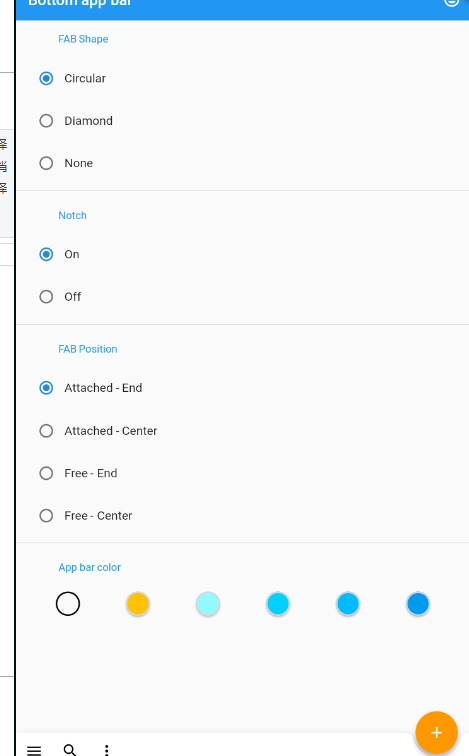
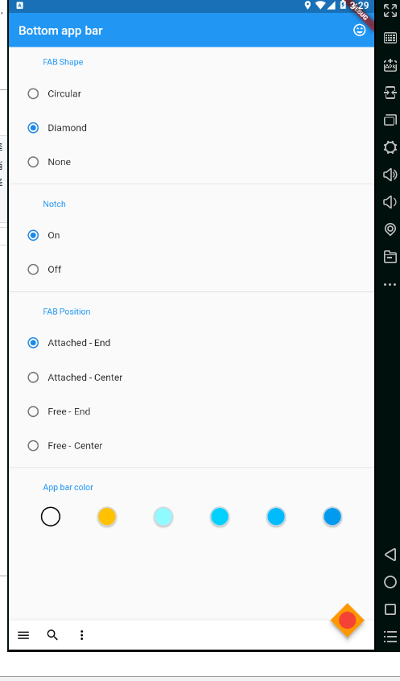
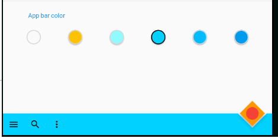
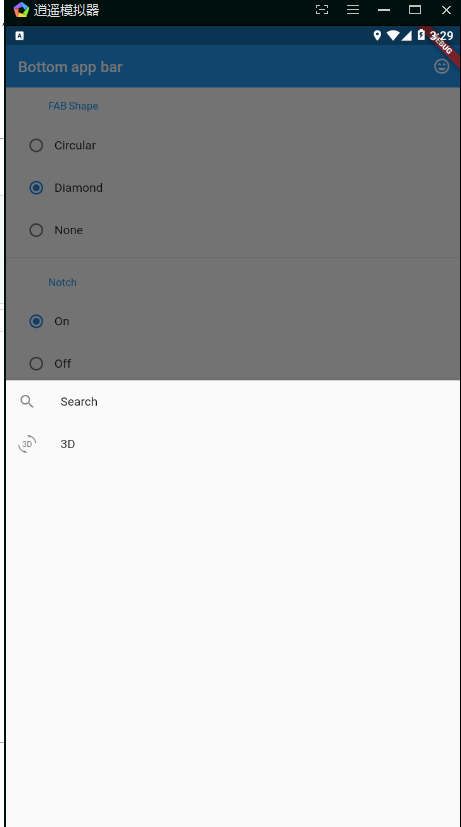

# bottom_app_bar

A new Flutter application.

## Getting Started

For help getting started with Flutter, view our online
[documentation](https://flutter.io/).
Flutter学习
使用到的内容：
Radio、 自定义 ShapeBorder、自定义 NotchedShape、InkWell 点击 水波纹widget、ListTile 模板item、IconButton

  
  
  

